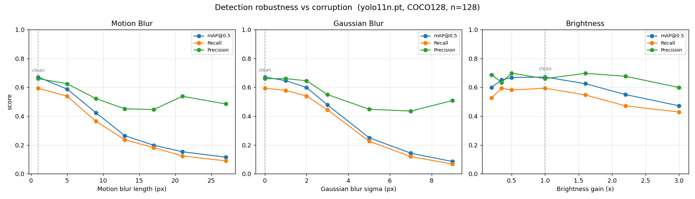

# Video Object Tracker — review, verification & robustness study

A Streamlit app (`app.py`) that runs YOLO11 tracking on an uploaded video and
returns an annotated result. This repo also contains a verification harness and
a robustness study measuring how **motion**, **blur**, and **brightness** affect
detection.

## Files

| File | Purpose |
|------|---------|
| `app.py` | The Streamlit tracking app (reviewed + hardened). |
| `corruptions.py` | Controlled image corruptions (motion blur, gaussian blur, brightness) + severity sweeps. |
| `verify_pipeline.py` | End-to-end check: synthesizes a moving clip, runs the app's exact track→write→encode loop, validates the output. |
| `robustness.py` | The study: corrupts COCO128 at rising severity and measures detection metrics with Ultralytics' official validation. |
| `robustness_out/` | Generated results: CSV, summary plot, qualitative example grids. |

```bash
pip install -r requirements.txt
streamlit run hub.py        # ← central hub: run ALL tools & browse results from one UI
streamlit run app.py        # the app
python3 verify_pipeline.py  # prove the pipeline works end-to-end
python3 robustness.py       # run the robustness study (downloads COCO128 once)
```

---

## 1. Code review of `app.py`

The core logic was sound, but a fresh deployment had **three reliability gaps**
(all fixed in this repo):

1. **Missing `lap` dependency.** The `bytetrack.yaml` / `botsort.yaml` trackers
   need the `lap` linear-assignment solver, which `requirements.txt` didn't list.
   On first run Ultralytics tries to pip-install it at runtime (needs internet +
   a writable env, took ~50 s here); on a locked-down/offline box it would crash.
   → Added `lap` to `requirements.txt`.

2. **Unplayable output codec, silently.** OpenCV writes `mp4v` (MPEG-4 Part 2),
   which most browsers can't play inline — so `st.video()` shows a blank player.
   The H.264 re-encode only runs *if* `ffmpeg` is on PATH, and the original code
   fell back to serving the unplayable `mp4v` file with no warning. (This machine
   has no `ffmpeg`, so every run hit this.)
   → The app now **warns the user** when `ffmpeg` is missing or the re-encode
   fails, and points them at the working Download button.

3. **No input validation.** If `VideoCapture` couldn't open the file (corrupt /
   unsupported codec), `width`/`height` came back `0`, the `VideoWriter` failed
   silently, the loop read zero frames, and the app reported **"Done — processed
   0 frames"** with an empty output.
   → The app now checks `cap.isOpened()`, validates frame dimensions and
   `writer.isOpened()`, guards the FPS value (0 / NaN), errors out clearly on bad
   input, releases resources in a `finally`, and refuses to "succeed" on 0 frames.

## 2. Does it reliably detect objects? — Yes (verified)

`verify_pipeline.py` synthesizes a clip with genuine camera motion (pan + zoom)
over a real multi-object image and runs the app's exact loop:

```
frames in / out      : 72 / 72
avg detections/frame : 3.57      (257 detections total)
unique track IDs     : 14
throughput           : 27 fps    (yolo11n, Apple M4 Pro / MPS)
VERDICT              : PASS
```

Annotations (boxes + track IDs + class + confidence) render correctly, e.g.
`id:2 refrigerator 0.63`, `id:3 microwave 0.68`. On the standard `bus.jpg` the
model detects the bus + 4 people at 0.62–0.94 confidence. Detection is reliable.

## 3. Effect of motion, blur & brightness on detection

**Method.** Take COCO128 (128 real images **with ground-truth labels**), apply
each corruption at increasing severity, and run Ultralytics' official validation
at each level. Severity 0 of every corruption is the identity transform, so the
first point is a clean baseline and every curve shows *relative* damage.

- **Motion** → directional motion-blur kernel (length in px), modelling a moving
  camera/object smearing the frame during exposure.
- **Blur** → isotropic Gaussian blur (sigma in px), modelling loss of focus.
- **Brightness** → multiplicative gain with clipping, modelling under-/over-exposure.

**Clean baseline (yolo11n, n=128):** mAP@0.5 = **0.671**, recall = **0.593**.



| Corruption | Worst point | mAP@0.5 | Recall | Max mAP@0.5 drop |
|---|---|---|---|---|
| Motion blur | 27 px | 0.115 | 0.090 | **−83%** |
| Gaussian blur | sigma 9 | 0.085 | 0.067 | **−87%** |
| Brightness | gain 3.0× | 0.471 | 0.428 | −30% |

### Key findings

1. **Blur is catastrophic; brightness is comparatively benign.** Either kind of
   blur erases ~85% of detection quality at high severity, while the worst
   brightness setting tested costs only ~30%. Blur destroys the high-frequency
   edges/texture the detector relies on; global brightness mostly preserves
   structure (and the model was trained with brightness augmentation).

2. **There's a cliff, not a slope.** Detection holds up to a threshold
   (motion ≈ 5 px, Gaussian sigma ≈ 2) then collapses rapidly. Small amounts of
   blur are tolerable; past the knee, performance falls off fast.

3. **The failure mode is missed objects, not false alarms.** Under blur,
   **recall collapses faster than precision** (precision stays ~0.45–0.5 while
   recall falls below 0.1). The model becomes conservative and *misses* objects
   rather than hallucinating them.

4. **Brightness is asymmetric — over-exposure hurts more than under-exposure.**
   Darkening to 0.2× gain costs only −11% mAP50 (0.599); over-exposing to 3.0×
   costs −30% (0.471). Blowing out highlights clips pixels to 255 and destroys
   texture irreversibly, whereas dark images retain relative structure. The model
   is happiest around 0.5–1.0× gain.

### What this means for the tracker

- **Motion blur is the biggest real-world risk** for a *video* tracker: fast
  camera/object motion + a long exposure smears frames. Prefer a fast shutter,
  and note that recall collapse under blur means more missed frames → more track
  fragmentation and ID switches.
- **Keep footage in focus** — defocus is just as damaging as motion blur.
- **Lighting is forgiving**, but avoid clipped/over-exposed highlights more than
  dim scenes.
- To harden against all three, step up from `yolo11n` to a larger model and/or
  raise the input `imgsz`.

### Reproduce / extend

`robustness.py` writes `robustness_out/robustness_results.csv` plus the summary
plot and per-corruption example grids. Edit the `SWEEPS` dict in `corruptions.py`
to change severities or add corruptions (e.g. JPEG compression, noise, fog); each
new entry is automatically swept, plotted, and summarized.

---

## 4. Effect on real video (objects in motion)

`video_robustness.py` extends the study to **real moving footage**. The clips are
unlabeled, so it uses the detector's output on the **clean** video as
pseudo-ground-truth, then applies rising motion blur and lighting changes and
measures how much survives: object **retention** (recall vs clean), mean
**confidence**, and mean **IoU** (localization).

```bash
python3 video_robustness.py samples/people.mp4 [--make-videos]
```

**Object retention vs corruption** (1.0 = same as clean):

| | blur 0 / 9 / 17 / 25 px | lighting 0.3 / 0.6 / 1.0 / 1.8× |
|---|---|---|
| `people.mp4` (large, close) | 1.00 / 0.94 / 0.86 / **0.59** | 0.92 / 0.97 / 1.00 / 0.97 |
| `traffic.mp4` (small, distant) | 1.00 / 0.58 / 0.37 / **0.14** | 0.80 / 0.93 / 1.00 / 0.85 |

### Findings (consistent with the still-image study, plus a new one)

1. **Blur is the killer; lighting is benign — confirmed on moving objects.**
   Heavy motion blur removes 41–86% of detections; across a 6× lighting range
   (0.3×–1.8×) retention never drops below 0.80.

2. **Object size dominates blur robustness (the new finding).** The *same* 25 px
   blur retains **59%** of the large, close people but only **14%** of the small,
   distant traffic objects. A fixed blur spans a large fraction of a small object's
   pixels (erasing it) but only a sliver of a big one. → In motion-heavy footage,
   **small/distant objects vanish first.**

3. **Detection fails binary, not gradually.** When an object *is* still found under
   blur, its box is still roughly right (IoU ≈ 0.83–0.86) at moderate confidence
   (≈ 0.62). Objects disappear entirely rather than degrading into sloppy boxes.

4. **Lighting is mild and roughly symmetric** — both darkening (0.3×) and
   brightening (1.8×) cost only ~5–20%, and small objects are slightly more
   sensitive than large ones.

**Practical takeaway for the tracker:** motion blur from fast motion / long
exposure is the dominant detection risk, *especially for small or distant
objects*. Mitigate with a faster shutter, higher input resolution, or a larger
model (`yolo11s/m`); lighting needs little attention. `--make-videos` renders the
worst-case annotated clips (`*_blur25.mp4`, `*_dark.mp4`) for side-by-side viewing.
